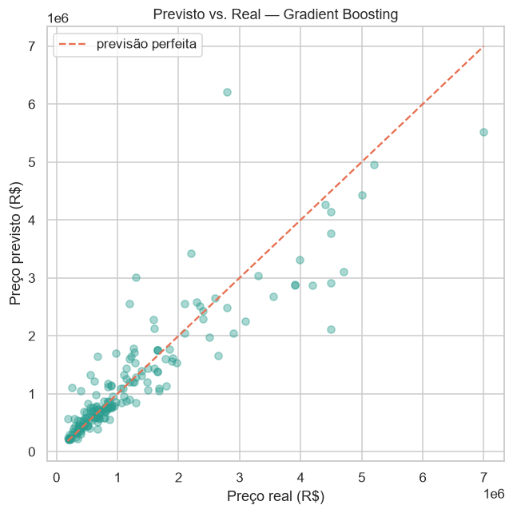
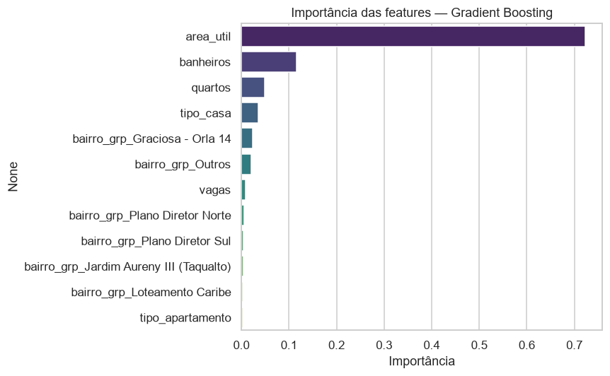
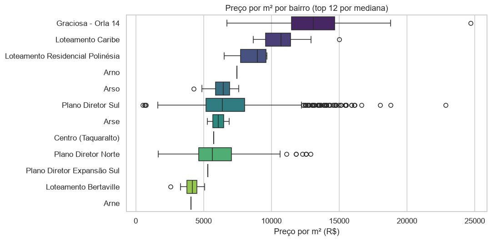

# 🏠 Previsão de Preços de Imóveis — Palmas/TO

> Regressão supervisionada de preços de imóveis a partir de um dataset **coletado por web scraping próprio** do portal Chaves na Mão — da coleta do dado bruto à modelagem e avaliação.

---

## 📌 Sobre o Projeto

Projeto de **regressão supervisionada** ponta a ponta. Diferente de usar um dataset pronto do Kaggle, aqui **os dados são coletados por um scraper próprio** dos anúncios de imóveis à venda em Palmas/TO, o que torna o pipeline completo: coleta → limpeza → análise → modelagem → avaliação.

O objetivo é prever o **preço de venda** de um imóvel a partir de suas características (área, número de quartos, banheiros, vagas de garagem, tipo e bairro).

### Perguntas respondidas

| # | Pergunta |
|---|----------|
| 1 | Quais características mais influenciam o preço de um imóvel em Palmas? |
| 2 | É possível prever o preço com erro aceitável a partir de atributos públicos do anúncio? |
| 3 | Como bairro e tipo de imóvel afetam o preço, controlando pela área? |
| 4 | Modelos lineares regularizados ou baseados em árvore preveem melhor? |

---

## 🕸️ Coleta de Dados (Web Scraping)

Os dados são coletados pelo script [`src/scraper.py`](src/scraper.py), que percorre as páginas
de listagem de imóveis à venda e extrai os campos de cada anúncio.

**Boas práticas adotadas:**
- ✅ Verificação do `robots.txt` antes de coletar (a paginação `?pg=` é explicitamente permitida).
- ✅ `User-Agent` honesto e **intervalo entre requisições** (rate limiting de 2s).
- ✅ Retries com backoff e decodificação UTF-8 explícita.
- ✅ Dados brutos **não versionados** — reproduzíveis rodando o scraper.

**Como coletar:**
```bash
pip install -r requirements.txt
python src/scraper.py --uf to --cidade palmas --max-paginas 100
# Gera: data/raw/imoveis_palmas_AAAAMMDD.csv
```

### Campos coletados

| Campo | Descrição |
|-------|-----------|
| `tipo` | Tipo do imóvel (casa, apartamento, terreno, sala comercial...) |
| `preco` | Preço de venda anunciado (R$) |
| `area_util` | Área útil em m² |
| `area_total` | Área total em m² (extraída da URL do anúncio) |
| `quartos`, `banheiros`, `vagas`, `salas` | Atributos do imóvel |
| `rua`, `bairro`, `cidade`, `uf` | Localização |
| `url` | Link do anúncio original |

---

## 📊 Resultados

Dataset modelado: **938 imóveis residenciais** de Palmas/TO (mediana de preço **R$ 838 mil**,
mediana de **R$ 6.364/m²**). Notebook completo em [`notebooks/01_eda_modelagem.ipynb`](notebooks/01_eda_modelagem.ipynb).

### Desempenho dos modelos (holdout 20%)

| Modelo | MAE (R$) | RMSE (R$) | R² (R$) | R² (log) |
|--------|---------:|----------:|--------:|---------:|
| Regressão Linear | 702 mil | 3,28 mi | -6,90 | 0,71 |
| Ridge | 698 mil | 3,30 mi | -6,97 | 0,71 |
| Lasso | 695 mil | 3,30 mi | -6,99 | 0,71 |
| Random Forest | 267 mil | 546 mil | 0,781 | — |
| 🏆 **Gradient Boosting** | **277 mil** | **515 mil** | **0,806** | — |

> **Validação cruzada (5-fold) do Gradient Boosting: R² (log) = 0,834 ± 0,029.**



### 💡 Nuance metodológica (o ponto interessante do projeto)

Os modelos lineares parecem catastróficos em R$ (R² negativo), mas são razoáveis em escala log
(R² ≈ 0,71). O motivo: o alvo é `log(preço)` e, ao reverter para reais com `expm1`, **uma única
previsão extrapolada explode exponencialmente** e destrói o RMSE. Modelos **baseados em árvore não
extrapolam** além do intervalo de treino, por isso são naturalmente robustos aqui. Avaliar a métrica
**no espaço certo** é o que separa uma conclusão correta de uma enganosa.

### 🔍 O que dirige o preço



**Área útil** e **localização (bairro)** dominam — coerente com o mercado. Graciosa/Orla 14
(~R$ 13 mil/m²) e Loteamento Caribe (~R$ 10,7 mil/m²) lideram o preço por m².



---

## 🔍 Metodologia

| Etapa | Abordagem |
|-------|-----------|
| **Limpeza** | Remoção de anúncios sem preço ("sob consulta"), filtro de tipos residenciais, corte de outliers de preço/área/preço-m² |
| **EDA** | Distribuição de preço (log), preço/m² por bairro, correlações |
| **Feature engineering** | Alvo em escala log, padronização, one-hot de tipo e bairro (raros → "Outros") |
| **Modelos** | Regressão Linear → Ridge/Lasso → Random Forest / Gradient Boosting |
| **Avaliação** | MAE, RMSE e R² em holdout + validação cruzada 5-fold |
| **Interpretação** | Importância de features e gráfico previsto vs. real |

---

## 📁 Estrutura do Projeto

```
PrecoImoveisBR/
│
├── src/
│   └── scraper.py              # Coleta os anúncios do Chaves na Mão
│
├── notebooks/
│   └── 01_eda_modelagem.ipynb  # EDA + limpeza + regressão (em construção)
│
├── data/
│   ├── raw/                    # CSVs coletados (não versionados)
│   └── processed/              # Dataset limpo para modelagem
│
├── images/                     # Gráficos exportados para o README
├── requirements.txt
└── README.md
```

---

## 🛠️ Tecnologias


---

## ⚖️ Nota sobre os dados

Os dados são coletados de anúncios públicos para fins **educacionais e de portfólio**, com
rate limiting e respeito ao `robots.txt`. Os CSVs brutos não são versionados; para reproduzir,
rode o scraper. Os preços refletem valores **anunciados** (não de transação efetivada).

---

## 👨‍💻 Autor

**Augusto Matos** — Analista de Dados & Desenvolvedor Python

[](https://www.linkedin.com/in/augusto-matos-b92887204)
[](https://github.com/augmatos)
